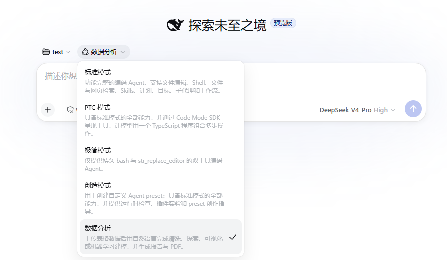
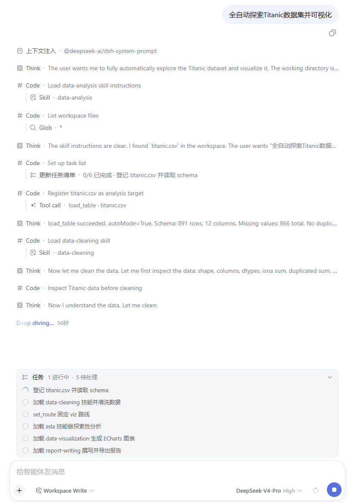
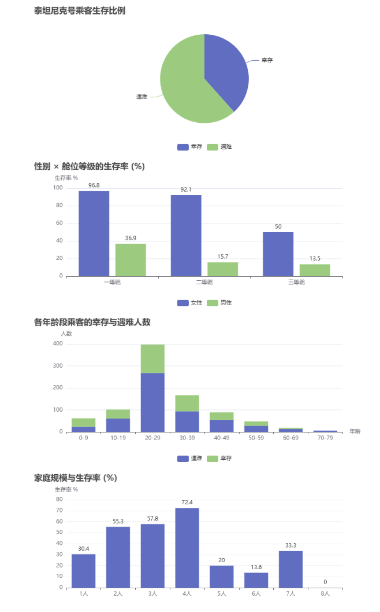
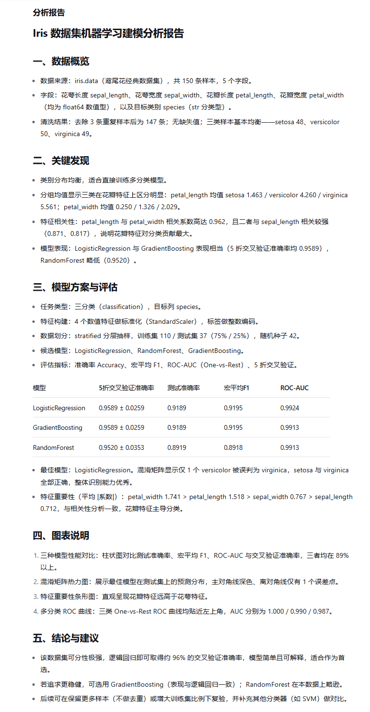

# 数据分析插件

这是一个给 DeepSeek Harness 使用的数据分析插件。安装以后，用户只要把一个表格文件交给它，再用一句话说明想分析什么，它就会自动完成后面的工作：读数据、清洗数据、做探索分析、画图或建模、生成报告。

## 现在能做什么

### 支持多种表格文件

插件可以直接读取下面这些文件：

- CSV 和 TSV 文本表格
- Excel 文件（`.xlsx`、`.xls`）
- JSON 数据
- Parquet 文件
- 普通文本文件（`.txt`）

读取时会自动判断文件编码、分隔符和表格结构，不需要用户手动告诉它“这是逗号分隔还是制表符分隔”。

### 自动清洗数据

模型会自动处理常见的数据问题，包括重复值、缺失值、数据类型错误和异常值。清洗后的中间结果会保存成文件，方便下一步继续使用。

### 自动做探索分析

插件会先帮用户快速了解数据：看看每列有多少空值、数据大致长什么样、有没有明显规律，再决定接下来怎么分析。

### 支持两条分析路线

- 可视化分析：生成可以在网页上交互的图表。
- 机器学习建模：做分类或回归任务。

用户可以在分析过程中选择走哪条路，也可以直接说“全自动”，让插件一路跑完。

### 自动生成报告

分析结束后，插件会生成一份 Markdown 报告，并尝试导出成 PDF。如果当前环境里没有 PDF 渲染工具，它会保留 HTML 版本，不让分析结果丢失。

### 过程可以回看

插件会把“读了哪个文件、选了哪条路线、画了哪些图、生成了哪份报告”都记录下来。用户刷新页面后，仍然能看到当前进度、已经生成的图表和报告。

## 界面预览









## 一次分析是怎么跑完的

1. 用户给出文件路径和分析问题。
2. 插件读取文件，生成一个标准格式的数据文件。
3. 插件自动清洗数据，把清洗后的数据保存下来。
4. 插件询问用户是否继续；如果用户一开始说了“全自动”，就跳过这一步。
5. 用户选择可视化分析或机器学习建模。
6. 插件做探索分析，然后画图或训练模型。
7. 插件保存图表和最终报告。
8. 插件尝试导出 PDF；没有 PDF 工具时，给用户 HTML 报告。

## 它由哪几部分组成

| 部分 | 作用 |
| --- | --- |
| Python 运行环境 | 在一个独立的 Python 进程里运行模型写的数据分析代码，避免影响主程序 |
| 分析工具 | 提供读取文件、选择路线、保存图表、保存报告、导出 PDF 等按钮 |
| 操作说明 | 告诉模型每一步应该怎么清洗、探索、画图和建模 |
| 网页展示层 | 把保存的图表和报告渲染成网页里的可交互卡片 |
| 安装组合包 | 把上面几个部分按正确顺序装到一起，让插件启动时能正常使用 |

如果你关心更具体的内部结构，可以看后面的架构文档。

## 安装

安装前需要准备三样东西：

- 一个可以运行的 DeepSeek Harness
- Python 3.11 或更高版本
- pnpm

推荐使用本地源码部署。下面的脚本会自动安装 profile 和 `data-analysis` agent preset。完整步骤见 [给人工看的安装、卸载与重装说明](docs/INSTALL.md)，快速路径是：

```powershell
cd <插件目录>
pnpm install
pnpm build
scripts\reinstall-local.ps1 -DshRoot <dsh 源码目录> -PluginRoot <插件目录>
cd <dsh 源码目录>
pnpm dsh --profile data-analysis
```

如果你希望让 AI 自动安装，请看：

- [给 AI 使用的自动安装说明](docs/INSTALL.for-agents.md)
- [给人工看的安装、卸载与重装说明](docs/INSTALL.md)

如果插件已经发布到 npm，也可以使用下面这条命令安装：

```sh
dsh plugin --profile data-analysis add @deepseek-ai/dsh-web-app@0.1.0-rc.6
dsh plugin --profile data-analysis add @andy1797833970/dsh-bundle-data-analysis
dsh plugin --profile data-analysis install
dsh --profile data-analysis
```

发布包安装后，还需要从插件源码目录安装一次 `data-analysis` agent preset：

```powershell
cd <插件目录>
scripts\install-preset.ps1
```

macOS / Linux：

```sh
cd <插件目录>
sh scripts/install-preset.sh
```

注意：

- 上面两条 `add` 命令要分开执行，不能合并成一条。
- `@deepseek-ai/dsh-web-app` 必须保留版本号 `0.1.0-rc.6`，因为 npm 的 `latest` 标签目前仍指向更早版本。

## 卸载

在插件源码目录下运行卸载脚本，会删除 `data-analysis` profile 和对应的 agent preset，但不会删除会话历史：

```powershell
scripts\uninstall.ps1
```

macOS / Linux：

```sh
sh scripts/uninstall.sh
```

如需同时删除插件根目录下的 `.venv`，加上 `-RemoveVenv`（PowerShell）或 `--remove-venv`（Shell）。

## 文档

| 文档 | 适合谁看 |
| --- | --- |
| [使用与概念说明](docs/data-analysis-plugin-tutorial.zh.md) | 想了解插件怎么用、内部有哪些零件的人 |
| [架构说明](docs/architecture.md) | 想知道插件内部怎么组合、数据怎么流动的人 |
| [开发与修改说明](docs/DEVELOPMENT.md) | 想修改插件或了解完整卸载方式的人 |
| [安装说明](docs/INSTALL.md) | 需要手动安装、卸载或重装的人 |
| [AI 自动安装说明](docs/INSTALL.for-agents.md) | 帮用户自动安装插件的 AI |
| [运行示例](examples/README.md) | 只想快速跑一个例子的人 |

## 当前限制

- PDF 导出依赖 Python 环境；如果环境里没有 PDF 渲染工具，就只给 HTML 报告。
- Python 代码运行在独立进程和文件沙箱里，但不是完整的容器级安全隔离。

## 后续计划

- 把 Python 运行环境升级到更严格的容器隔离。
- 增加更多数据来源和更多报告格式。
- 提供更简单的跨平台一键安装方式。

## License

[MIT](LICENSE)
